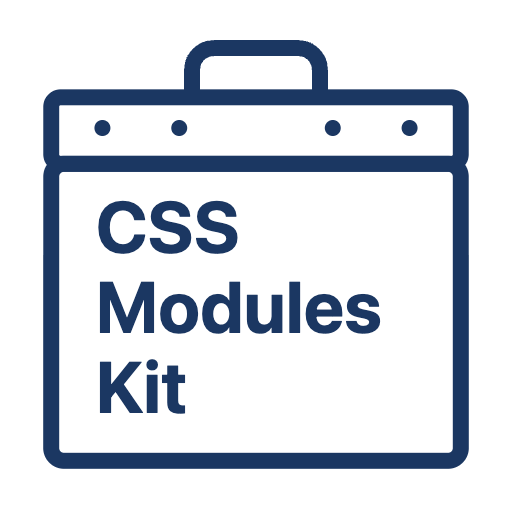

# CSS Modules Kit

A toolkit for making CSS Modules useful.

<p align="center">
  
</p>

## Intro

By default, CSS Modules have limited language features in editors. For example:

- Clicking on `styles.button` does not go to its definition in `Button.module.css`.
- Renaming `styles.button` does not rename the corresponding `.button {...}` in `Button.module.css`.
- Find all references of `styles.button` does not include its definition in `Button.module.css`.

It has been difficult to solve these issues because the TypeScript Language Server (tsserver) does not handle CSS files. Since tsserver does not load CSS files, it cannot determine which definitions to go to or which code to rename.

css-modules-kit solves this problem by using the [TypeScript Language Service Plugin](https://github.com/microsoft/TypeScript/wiki/Writing-a-Language-Service-Plugin). css-modules-kit extends tsserver to handle `*.module.css` files using it. As a result, rich language features like code navigation and rename refactoring become available. Moreover, it works with various editors.

css-modules-kit also provides various development tools for CSS Modules. For example, stylelint plugins and the tool that generates `*.d.ts` files.

## Supported Language Features

<details>
<summary>Go to Definition</summary>

https://github.com/user-attachments/assets/bdeb2c8a-d615-4223-bae4-e7446f62d353

</details>

<details>
<summary>Rename Symbol</summary>

https://github.com/user-attachments/assets/db39a95e-2fc8-42a6-a64d-02f2822afbfe

</details>

<details>
<summary>Find all references</summary>

https://github.com/user-attachments/assets/df1e2feb-2a1a-4bf5-ae70-1cac36d90409

</details>

<details>
<summary>Definition Preview by Hover</summary>

You can preview the definition with <kbd>Command</kbd> + <kbd>Hover</kbd> on macOS and VS Code (key bindings may vary depending on your OS and editor).

https://github.com/user-attachments/assets/8d42acb8-2822-4fe6-89ce-8472c7065b8b

</details>

<details>
<summary>Automatically update import statements when moving `*.module.css`</summary>

https://github.com/user-attachments/assets/4af168fa-357d-44e1-b010-3053802bf1a2

</details>

<details>
<summary>Create CSS Module file for current file</summary>

If there is no CSS Module file corresponding to `xxx.tsx`, create one.

https://github.com/user-attachments/assets/05f9e839-9617-43dc-a519-d5a20adf1146

</details>

<details>
<summary>Complete `className={...}` instead of `className="..."`</summary>

In projects where CSS Modules are used, the element is styled with `className={styles.xxx}`. However, when you type `className`, `className="..."` is completed. This is annoying to the user.

So, instead of `className="..."` instead of `className={...}` instead of `className="..."`.

https://github.com/user-attachments/assets/b3609c8a-123f-4f4b-af8c-3c8bf7ab4363

</details>

<details>
<summary>Prioritize the `styles' import for the current component file</summary>

When you request `styles` completion, the CSS Module file `styles` will be suggested. If there are many CSS Module files in the project, more items will be suggested. This can be confusing to the user.

So I have made it so that the `styles` of the CSS Module file corresponding to the current file is shown first.


</details>

<details>
<summary>Add missing CSS rule</summary>

If you are trying to use a class name that is not defined, you can add it with Quick Fixes.

https://github.com/user-attachments/assets/3502150a-985d-45f3-9912-bbc183e41c03

</details>

## Get Started

Please read the [Get Started](docs/get-started.md) guide.

## How to try demo

1. Open this repository with VS Code
2. Open `Run and Debug` menu
3. Select `vscode (1-basic)` configuration and start debugging

## Configuration

css-modules-kit uses `tsconfig.json` as its configuration file.

### `include`/`exclude`

In TypeScript, the `include`/`exclude` properties specify which `*.ts` files to compile. css-modules-kit reuses these options to determine which `*.module.css` files to handle with codegen and ts-plugin. Therefore, make sure your `*.module.css` files are included in the `include` or `exclude` settings.

```jsonc
{
  // For example, if your project's `*.module.css` files are in `src/`:
  "include": ["src"], // Default is ["**/*"], so it can be omitted
  "compilerOptions": {
    // ...
  },
}
```

### `cmkOptions.dtsOutDir`

Type: `string`, Default: `"generated"`

Specifies the directory where `*.d.ts` files are output.

```jsonc
{
  "compilerOptions": {
    // ...
  },
  "cmkOptions": {
    "dtsOutDir": "generated/cmk",
  },
}
```

### `cmkOptions.arbitraryExtensions`

Type: `boolean`, Default: `false`

Determines whether to generate `*.module.d.css.ts` instead of `*.module.css.d.ts`.

```jsonc
{
  "compilerOptions": {
    // ...
  },
  "cmkOptions": {
    "arbitraryExtensions": true,
  },
}
```

### `cmkOptions.namedExports`

Type: `boolean`, Default: `false`

Determines whether to generate named exports in the d.ts file instead of a default export.

```jsonc
{
  "compilerOptions": {
    // ...
  },
  "cmkOptions": {
    "namedExports": true,
  },
}
```

### `cmkOptions.prioritizeNamedImports`

Type: `boolean`, Default: `false`

Whether to prioritize named imports over namespace imports when adding import statements. This option only takes effect when `cmkOptions.namedExports` is `true`.

When this option is `true`, `import { button } from '...'` will be added. When this option is `false`, `import button from '...'` will be added.

```jsonc
{
  "compilerOptions": {
    // ...
  },
  "cmkOptions": {
    "namedExports": true,
    "prioritizeNamedImports": true,
  },
}
```

### `cmkOptions.keyframes`

Type: `boolean`, Default: `true`

Determines whether to generate the [token](docs/glossary.md#token) of keyframes in the d.ts file.

```jsonc
{
  "compilerOptions": {
    // ...
  },
  "cmkOptions": {
    "keyframes": false,
  },
}
```

## Supported CSS Modules features

- `:local(...)` and `:global(...)`
- `@keyframes <name> { ... }`
- `@value <name>: <value>;`
- `@value <name>[, <value>]+ from <module-specifier>;`
- `@import <module-specifier>;`

## Limitations

To simplify the implementation, some features are not supported.

- Sass and Less are not supported.
  - If you want to use Sass and Less, please use [happy-css-modules](https://github.com/mizdra/happy-css-modules). Although it does not offer as rich language features as css-modules-kit, it provides basic features such as code completion and Go to Definition.
- The name of classes, `@value`, and `@keyframes` must be valid JavaScript identifiers.
  - For example, `.fooBar` and `.foo_bar` are supported, but `.foo-bar` is not supported.
  - See [#176](https://github.com/mizdra/css-modules-kit/issues/176) for more details.
- `:local .foo {...}` is not supported.
  - Use `:local(.foo) {...}` instead.
- `:global .foo {...}` is not supported.
  - Use `:global(.foo) {...}` instead.
- `@keyframes :local(foo) {...}` is not supported.
  - Use `@keyframes foo {...}` instead.
  - Meanwhile, `@keyframes :global(foo) { ... }` is supported.
- VS Code for Web is not supported.

## Comparison

### [Viijay-Kr/react-ts-css](https://github.com/Viijay-Kr/react-ts-css)

Viijay-Kr/react-ts-css also provides rich language features for CSS Modules. However, it is implemented using the VS Code Extension API. Therefore, it only supports VS Code.

On the other hand, css-modules-kit is implemented using the TypeScript Language Service Plugin. It is a technology that does not depend on the editor. css-modules-kit supports editors other than VS Code.

### [mrmckeb/typescript-plugin-css-modules](https://github.com/mrmckeb/typescript-plugin-css-modules)

mrmckeb/typescript-plugin-css-modules is also implemented using the TypeScript Language Service Plugin. However, it only supports basic language features such as completion, typed `styles`, and Go to Definition. Cross-file language features between `*.tsx` and `.module.css`—such as Rename and Find All References—are not supported.

This is because mrmckeb/typescript-plugin-css-modules does not extend tsserver to handle `*.module.css` files. Due to the lack of information about `*.module.css` files, tsserver cannot provide cross-file language features between `*.tsx` and `.module.css`.

On the other hand, css-modules-kit extends tsserver to handle `*.module.css` files. The extension is realized by [Volar.js](https://volarjs.dev/). Please read the following slides for details (in Japanese).

- https://speakerdeck.com/mizdra/css-modules-kit
